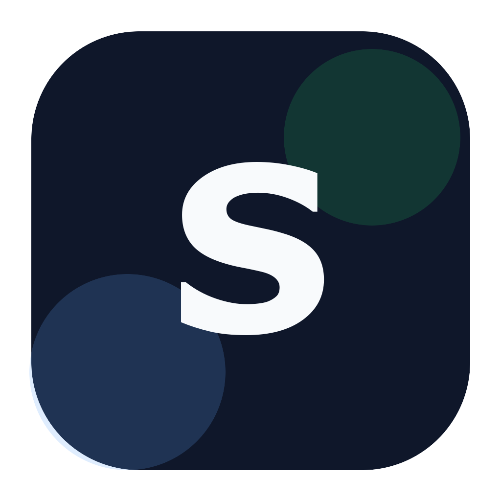

# Sly



A minimalist, offline-first markdown note-taking app for macOS, Windows, and Linux.

  

[Repository](https://github.com/waynevernon/sly) · [Releases](https://github.com/waynevernon/sly/releases)

## Features

- **Offline-first** - No cloud, no account, no internet required
- **Markdown-based** - Notes stored as plain `.md` files you own
- **WYSIWYG editing** - Rich text editing that saves as markdown
- **Preview mode** - Open any `.md` file via drag-and-drop or "Open With" without a notes folder
- **Markdown source mode** - Toggle to view and edit raw markdown (`Cmd+Shift+M`)
- **Syntax highlighting** - 20 languages with GitHub-inspired color scheme
- **Mermaid diagrams** - Render flowcharts, sequence diagrams, and more in fenced code blocks
- **KaTeX math** - Render block `$$...$$` math equations
- **Wikilinks** - Type `[[` to link between notes with autocomplete
- **Slash commands** - Type `/` to quickly insert headings, lists, code blocks, diagrams, and more
- **Focus mode** - Distraction-free writing with animated sidebar/toolbar fade (`Cmd+Shift+Enter`)
- **Edit with Claude Code, OpenAI Codex, OpenCode, or Ollama** - Use your local CLI to edit notes with AI (including fully offline via Ollama)
- **Works with other AI agents** - Detects external file changes
- **Folders** - Opt-in collapsible folder tree with drag-and-drop to organize notes
- **Keyboard optimized** - Lots of shortcuts and a command palette
- **Customizable** - Theme, typography, page width, and RTL text direction
- **Git integration** - Optional version control with push/pull for multi-device sync
- **Lightweight** - 5-10x smaller than Obsidian or Notion

## Screenshot


## Installation

### macOS

1. Download the latest `.dmg` from [Releases](https://github.com/waynevernon/sly/releases)
2. Open the DMG and drag Sly to Applications
3. Open Sly from Applications

### Windows

Download the latest `.exe` installer from [Releases](https://github.com/waynevernon/sly/releases) and run it. WebView2 will be downloaded automatically if needed.

### Linux

Download the latest `.AppImage` or `.deb` from [Releases](https://github.com/waynevernon/sly/releases).

### From Source

**Prerequisites:** Node.js 18+, Rust 1.70+

**macOS:** Xcode Command Line Tools · **Windows:** WebView2 Runtime (pre-installed on Windows 11)

```bash
git clone https://github.com/waynevernon/sly.git
cd sly
npm install
npm run tauri dev      # Development
npm run tauri build    # Production build
```

## Keyboard Shortcuts

Sly is designed to be usable without a mouse. Here are the essentials to get started:

| Shortcut          | Action                 |
| ----------------- | ---------------------- |
| `Cmd+N`           | New note               |
| `Cmd+D`           | Duplicate note         |
| `Delete`          | Delete note            |
| `Cmd+Backspace`   | Delete note            |
| `Cmd+P`           | Command palette        |
| `Cmd+K`           | Add/edit link          |
| `Cmd+F`           | Find in note           |
| `Cmd+Shift+C`     | Copy & Export menu     |
| `Cmd+Shift+M`     | Toggle Markdown source |
| `Cmd+Shift+Enter` | Toggle Focus mode      |
| `Cmd+Shift+F`     | Search notes           |
| `Cmd+R`           | Reload current note    |
| `Cmd+,`           | Open settings          |
| `Cmd+\`           | Toggle sidebar         |
| `Cmd+B/I`         | Bold/Italic            |
| `Cmd+=/-/0`       | Zoom in/out/reset      |
| `↑/↓`             | Navigate notes         |

**Note:** On Windows, use `Ctrl` instead of `Cmd` for all shortcuts.

Many more shortcuts and features are available in the app—explore via the command palette (`Cmd+P` / `Ctrl+P`) or view the full reference in Settings → Shortcuts.

## Built With

[Tauri](https://tauri.app/) · [React](https://react.dev/) · [TipTap](https://tiptap.dev/) · [Tailwind CSS](https://tailwindcss.com/) · [Tantivy](https://github.com/quickwit-oss/tantivy)

## Contributing

Contributions and suggestions are welcome. Sly is an independent fork of Scratch, maintained separately and free to diverge.

If you want to propose a larger behavioral or product change, open an issue first so the intended direction is clear before implementation.

## Attribution

Sly is a hard fork of Scratch. Original project work remains credited under the MIT license.

## License

MIT
