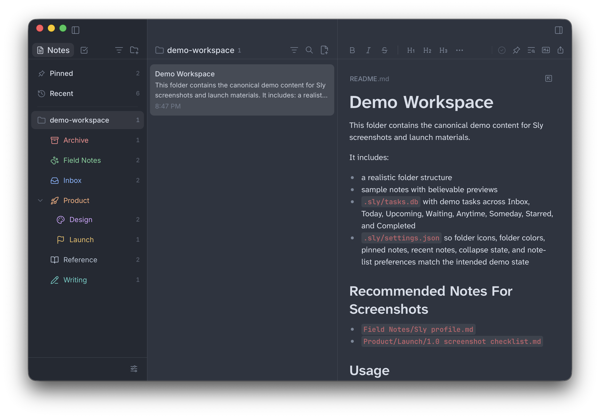
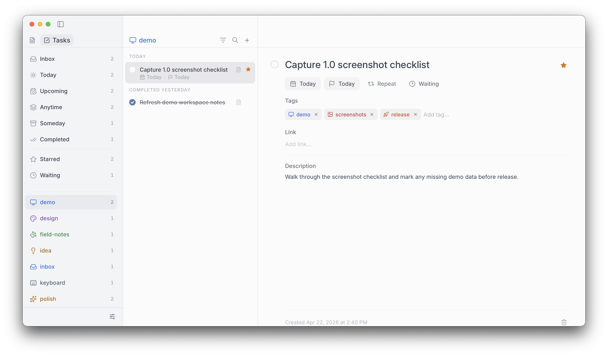

<p align="left">
  
</p>

# Sly
Markdown notes and task planning, local by default.

Sly is a macOS workspace for people who want a real app without giving up their files. Open a folder of markdown notes and get a calm editor, fast navigation, built-in task planning, local AI hooks, Git, and a scriptable CLI.

Your notes stay on disk as plain `.md` files. Your tasks live with the same workspace. Nothing gets trapped in someone else's cloud.

Developed by [Wayne Vernon](https://github.com/waynevernon) as an independent fork of [Scratch](https://github.com/erictli/scratch), the original project by Eric Li.


[Releases](https://github.com/waynevernon/sly/releases) · [Report an Issue](https://github.com/waynevernon/sly/issues)




## What Sly is

Sly is for local notes, serious task capture, and keyboard-driven work. It gives you the shape of a modern productivity app while keeping the files simple enough to open anywhere.

- Work directly in a folder of markdown files.
- Write in a polished rich text editor, or switch to markdown source when you want the raw file.
- Capture tasks into Inbox, Today, Upcoming, Anytime, Someday, Waiting, Completed, and Starred.
- Add dates, due dates, tags, links, waiting-for notes, stars, and recurrence.
- Search notes and tasks quickly, open commands from the keyboard, and keep recent work close.
- Use 1, 2, or 3 panes, detach notes into their own windows, and tune the editor width.
- Bring your own AI through Claude Code, OpenAI Codex, OpenCode, or Ollama.
- Initialize, commit, and push Git repos from the app.
- Use the `sly` CLI for capture, search, scripting, and opening notes from the terminal.

## Why it exists

Most notes apps eventually ask you to choose between comfort and ownership. Sly tries to avoid that bargain. It feels like an app, but it behaves like a folder.

That means your daily workspace can have nice things: focus mode, wikilinks, Mermaid diagrams, KaTeX math, tables, image support, syntax-highlighted code, task planning, themes, fonts, zoom, and Git. But the center stays boring in the best way: markdown on disk.

## Installation

### macOS

Install stable from Homebrew:

```bash
brew tap waynevernon/sly
brew install --cask waynevernon/sly/sly
```

Install the beta channel from Homebrew:

```bash
brew tap waynevernon/sly
brew install --cask waynevernon/sly/sly@beta
```

The beta channel follows whichever published release is newer between the latest stable and latest beta, so stable promotions flow through automatically. Homebrew stable and beta installs conflict by design, so install one channel or the other.

If you prefer a direct install, download the latest DMG from the [Releases](https://github.com/waynevernon/sly/releases) page, open it, and drag Sly to Applications.

## Keyboard shortcuts

Sly is designed to stay usable from the keyboard. A few of the core shortcuts:

| Shortcut | Action |
| --- | --- |
| `Cmd/Ctrl+N` | Create a new note |
| `Cmd/Ctrl+P` | Open the command palette |
| `Cmd/Ctrl+F` | Find in the current note |
| `Cmd/Ctrl+Shift+F` | Search notes |
| `Cmd/Ctrl+Shift+M` | Toggle markdown source mode |
| `Cmd/Ctrl+Shift+Enter` | Toggle focus mode |
| `Cmd/Ctrl+,` | Open settings |
| `Cmd/Ctrl+Shift+J`, `K`, `L` | Switch to 1, 2, or 3 panes |
| `Cmd/Ctrl+\\` | Cycle workspace layout |
| `Cmd/Ctrl+=`, `-`, `0` | Zoom in, out, reset |

Open Settings > Shortcuts inside the app for the full reference.

## CLI

On macOS, install the CLI from Settings > Assistant & CLI. The `sly` command keeps the app launch behavior you would expect:

- `sly` launches Sly
- `sly .` opens a notes folder
- `sly file.md` opens a markdown file

It also gives you terminal access to notes and tasks:

```bash
sly doctor [--format table|json]
sly [--notes-folder PATH] note list [--folder PATH] [-q QUERY] [-n N] [--format table|json|csv]
sly [--notes-folder PATH] note search QUERY [--folder PATH] [-n N] [--format table|json|csv]
sly [--notes-folder PATH] note show SELECTOR [--format text|json]
sly [--notes-folder PATH] note create TITLE [--folder PATH] [--content TEXT | --content-file PATH] [--format text|json]
sly [--notes-folder PATH] note append SELECTOR TEXT [--no-newline] [--format text|json]
sly [--notes-folder PATH] note open SELECTOR
sly [--notes-folder PATH] task list [--view all|inbox|today|upcoming|waiting|anytime|someday|completed|starred] [-q QUERY] [-n N] [--format table|json|csv]
sly [--notes-folder PATH] task search QUERY [--view all|inbox|today|upcoming|waiting|anytime|someday|completed|starred] [-n N] [--format table|json|csv]
sly [--notes-folder PATH] task show SELECTOR [--format text|json]
sly [--notes-folder PATH] task create TITLE [--description TEXT] [--link URL] [--waiting-for TEXT] [--date YYYY-MM-DD | --bucket anytime|someday] [--due-date YYYY-MM-DD] [--starred] [--recurrence RULE] [--tag TAG ...] [--format text|json]
sly [--notes-folder PATH] task update SELECTOR [--title TEXT] [--description TEXT | --clear-description] [--link URL | --clear-link] [--waiting-for TEXT | --clear-waiting-for] [--date YYYY-MM-DD | --clear-date] [--bucket anytime|someday | --clear-bucket] [--due-date YYYY-MM-DD | --clear-due-date] [--starred | --unstarred] [--recurrence RULE | --clear-recurrence] [--tag TAG ... | --clear-tags] [--format text|json]
sly [--notes-folder PATH] task complete SELECTOR [--format text|json]
sly [--notes-folder PATH] task reopen SELECTOR [--format text|json]
sly [--notes-folder PATH] task reschedule SELECTOR (--date YYYY-MM-DD | --bucket anytime|someday | --clear) [--format text|json]
sly [--notes-folder PATH] task delete SELECTOR
```

Single-task commands resolve selectors in this order:

1. Exact UUID
2. Exact title
3. Unique UUID prefix
4. Unique case-insensitive title fragment

Global option:

- `--notes-folder PATH`: use a specific notes folder instead of the folder saved in Sly app config

`doctor`:

- `--format table|json`: show discovery details as a terminal report or machine-readable JSON

`note list` options (`note search` is an alias that takes the query as a positional argument):

- `-q`/`--query TEXT`: filter notes by text across title, preview, and note ID
- `--folder PATH`: limit results to a folder and its subfolders
- `-n`/`--limit N`: cap the number of returned notes
- `--format table|json|csv`: choose human-readable table output or machine-readable JSON/CSV

`note show`, `note create`, `note append`, and `note open`:

- `SELECTOR`: exact note ID, exact title, unique ID prefix, or unique case-insensitive title fragment
- `note show --format text|json`: print raw markdown content or the full note object
- `note create TITLE`: create a markdown note with `# TITLE`
- `note create --folder PATH`: place the note in a folder
- `note create --content TEXT` or `--content-file PATH`: add initial body content below the heading
- `note append SELECTOR TEXT`: append text to an existing note
- `note append --no-newline`: append without adding a trailing newline
- `note open SELECTOR`: open the note in Sly

`task list` options (`task search` is an alias that takes the query as a positional argument):

- `-q`/`--query TEXT`: filter tasks by text across title, description, link, waiting-for, and tags
- `--view ...`: filter to one task horizon or bucket
- `-n`/`--limit N`: cap the number of returned tasks
- `--format table|json|csv`: choose human-readable table output or machine-readable JSON/CSV

`task show`:

- `SELECTOR`: exact UUID, exact title, unique UUID prefix, or unique case-insensitive title fragment
- `--format text|json`: show a terminal-friendly view or the full task object

`task create`:

- `TITLE`: task title
- `--description TEXT`: set description
- `--link URL`: set link
- `--waiting-for TEXT`: mark the task as waiting on someone or something
- `--date YYYY-MM-DD`: schedule the task for a specific day
- `--due-date YYYY-MM-DD`: set a deadline separate from the action date
- `--bucket anytime|someday`: assign an unscheduled horizon bucket
- `--starred`: star the task
- `--recurrence RULE`: set recurrence, such as `daily:schedule`, `weekly:completion`, or `monthly:schedule:15`
- `--tag TAG`: add a tag; repeat for multiple tags
- `--format text|json`: print terminal text or the full task object

`task update`:

- `SELECTOR`: same selector rules as `task show`
- `--title TEXT`: replace the title
- `--description TEXT` or `--clear-description`: replace or clear the description
- `--link URL` or `--clear-link`: replace or clear the link
- `--waiting-for TEXT` or `--clear-waiting-for`: replace or clear the waiting-for field
- `--date YYYY-MM-DD` or `--clear-date`: replace or clear the scheduled day
- `--bucket anytime|someday` or `--clear-bucket`: replace or clear the schedule bucket
- `--due-date YYYY-MM-DD` or `--clear-due-date`: replace or clear the deadline
- `--starred` or `--unstarred`: update star state
- `--recurrence RULE` or `--clear-recurrence`: replace or clear recurrence
- `--tag TAG` or `--clear-tags`: replace tags with the provided repeated tag list, or clear all tags
- `--format text|json`: print terminal text or the full task object

`task complete`, `task reopen`, and `task reschedule`:

- `SELECTOR`: same selector rules as `task show`
- `task complete` / `task reopen`: toggle completion state
- `task reschedule --date YYYY-MM-DD`: assign a specific day
- `task reschedule --bucket anytime|someday`: assign a bucket instead of a date
- `task reschedule --clear`: clear both date and bucket
- `--format text|json`: print terminal text or the full task object

Examples:

```bash
# Show discovery and task-store status
sly doctor

# Use a specific vault without changing the app's saved folder
sly --notes-folder ~/Notes task list --view today

# Capture a new task directly into Anytime
sly task create "Plan launch notes" --bucket anytime

# Search tasks as JSON for scripting
sly task search launch --format json

# Schedule a task for a specific day
sly task reschedule "Plan launch notes" --date 2026-04-12

# Mark a task complete by UUID prefix
sly task complete 0195d9f1
```

## Build from source

### Requirements

- macOS
- Node.js 18+
- Rust stable
- Xcode command line tools

### Local development

```bash
git clone https://github.com/waynevernon/sly.git
cd sly
npm install
npm run tauri dev
```

### Local verification

```bash
npm run verify
cd src-tauri
cargo test
cargo check
cargo clippy --all-targets --all-features -- -D warnings
```

## Credits

- Sly is maintained by [Wayne Vernon](https://github.com/waynevernon).
- Sly builds on [Scratch](https://github.com/erictli/scratch), the original project created by Eric Li.
- Scratch's original work remains credited under the MIT license.

## License

[MIT](./LICENSE)
