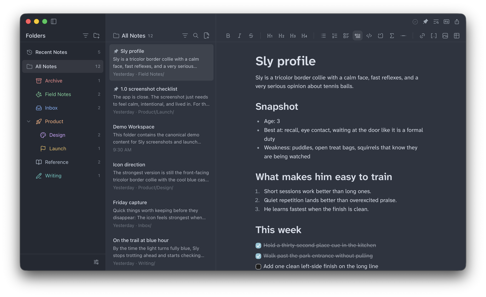

<p align="left">
  
</p>

# Sly
Sly is an editor-first markdown notes app for macOS, Windows, and Linux. It keeps your notes on disk as plain markdown files, stays fast on real folders, and adds optional AI and Git workflows without turning your notes into a cloud product.

Sly is developed by [Wayne Vernon](https://github.com/waynevernon) as an independent fork of [Scratch](https://github.com/erictli/scratch), the original project created by Eric Li.

  

[Releases](https://github.com/waynevernon/sly/releases) · [Report an Issue](https://github.com/waynevernon/sly/issues)



## Features

- Plain markdown notes you own. Open a folder, work directly with `.md` files on disk, and keep your notes usable outside the app.
- A serious writing and editing surface. Sly combines a polished rich editor with markdown source mode, Focus Mode, wikilinks, slash commands, Mermaid diagrams, KaTeX math, tables, inline link editing, image support, and syntax-highlighted code blocks.
- Fast navigation through large note collections. Full-text search, command palette workflows, recent notes, find-in-note, better keyboard folder navigation, and keyboard-first shortcuts keep you moving without digging through menus.
- A lightweight task mode when notes turn into action. Enable the beta tasks view to capture work in an inbox, sort it into Today, Upcoming, Someday, Waiting, and Logbook, and keep task notes in plain markdown inside your vault.
- Flexible organization that still feels lightweight. Use pinned and recent notes, a dedicated pinned notes view, recursive folder views, per-folder note sorting, folder sorting, note counts, drag-and-drop, multi-note move/delete, rename and duplicate commands, and customizable folder icons with color or emoji.
- Editor-first layouts that adapt to how you work. Switch between 1, 2, and 3 pane views, detach notes into their own windows, tune editor width, and keep folders, note lists, outline, assistant, and the current note visible in the balance you want.
- Optional AI help without AI lock-in. Use the built-in side assistant or run note editing flows through Claude Code, OpenAI Codex, OpenCode, or Ollama when you want assistance, while keeping plain files and local workflows at the center.
- Built-in Git workflows for notes on disk. Initialize a repo, inspect status, commit changes, configure remotes, and push without leaving the app.
- Deep workspace customization. Choose from a growing set of theme presets, bundled fonts, separate UI/note/code font controls, typography tuning, text direction, and interface zoom.
- Useful desktop extras. Open markdown files in standalone preview mode before choosing a notes folder, use the dedicated print preview window for PDF export, install the `sly` CLI on supported platforms, and get in-app update checks through the Tauri updater.

## Platform Status

- macOS is the primary day-to-day development and validation target.
- Windows and Linux release artifacts are produced, but they are not yet manually validated for every release.
- If you run Sly on Windows or Linux, treat those builds as early support until release validation is more consistent.

## Installation

### macOS

Install stable from Homebrew:

```bash
brew tap waynevernon/sly
brew install --cask waynevernon/sly/sly
```

Install the beta channel from Homebrew:

```bash
brew tap waynevernon/sly
brew install --cask waynevernon/sly/sly@beta
```

The beta channel follows whichever published release is newer between the latest stable and latest beta, so stable promotions flow through automatically. Homebrew stable and beta installs conflict by design, so install one channel or the other.

If you prefer a direct install, download the latest DMG from the [Releases](https://github.com/waynevernon/sly/releases) page, open it, and drag Sly to Applications.

### Windows

Download the latest `.exe` installer from the [Releases](https://github.com/waynevernon/sly/releases) page and run it. WebView2 will be downloaded automatically if needed.

Windows builds are not yet manually validated for every release.

### Linux

Download the latest `.AppImage` or `.deb` from the [Releases](https://github.com/waynevernon/sly/releases) page.

Linux builds are not yet manually validated for every release.

## Keyboard Shortcuts

Sly is designed to stay usable from the keyboard. A few of the core shortcuts:

| Shortcut | Action |
| --- | --- |
| `Cmd/Ctrl+N` | Create a new note |
| `Cmd/Ctrl+P` | Open the command palette |
| `Cmd/Ctrl+F` | Find in the current note |
| `Cmd/Ctrl+Shift+F` | Search notes |
| `Cmd/Ctrl+Shift+M` | Toggle markdown source mode |
| `Cmd/Ctrl+Shift+Enter` | Toggle focus mode |
| `Cmd/Ctrl+,` | Open settings |
| `Cmd/Ctrl+1`, `2`, `3` | Switch pane layout |
| `Cmd/Ctrl+\\` | Cycle workspace layout |
| `Cmd/Ctrl+=`, `-`, `0` | Zoom in, out, reset |

Open Settings → Shortcuts inside the app for the full reference.

## Build From Source

### Requirements

- Node.js 18+
- Rust stable
- Platform prerequisites for Tauri v2

### Local development

```bash
git clone https://github.com/waynevernon/sly.git
cd sly
npm install
npm run tauri dev
```

### Local verification

```bash
npm run verify
cd src-tauri
cargo test
cargo check
cargo clippy --all-targets --all-features -- -D warnings
```

## Credits

- Sly is maintained by [Wayne Vernon](https://github.com/waynevernon).
- Sly builds on [Scratch](https://github.com/erictli/scratch), the original project created by Eric Li.
- Scratch's original work remains credited under the MIT license.

## License

[MIT](./LICENSE)
