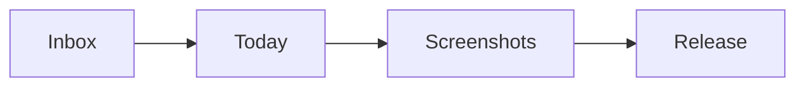

# Task tag setup

The demo task list uses tags for the main screenshot flows. Tags have custom icons and colors in `.sly/settings.json`, so the left task sidebar should show more than plain hash labels.

## Tags in use

| Tag | Used for |
| --- | --- |
| release | Launch notes, updater copy, and release checklist work |
| screenshots | README and app store style captures |
| design | Icon and empty state passes |
| writing | Draft notes and public copy |
| field-notes | Dog training and walking reference |
| recurring | Repeating route prep |
| waiting | Items blocked on another pass |

## Capture examples

- [x] Add tags to the seeded task database
- [x] Give the visible tags distinct icons and colors
- [ ] Open the task sidebar and check that each tag bucket has at least one task

Try quick capture with something like:

```text
Review README crop tomorrow #screenshots #readme
```

The title should lose the inline tags after capture, then the task should appear under both tag buckets.



Small sizing reminder for the screenshot crop: $16:10$ usually gives the README enough room without hiding the task tags.
